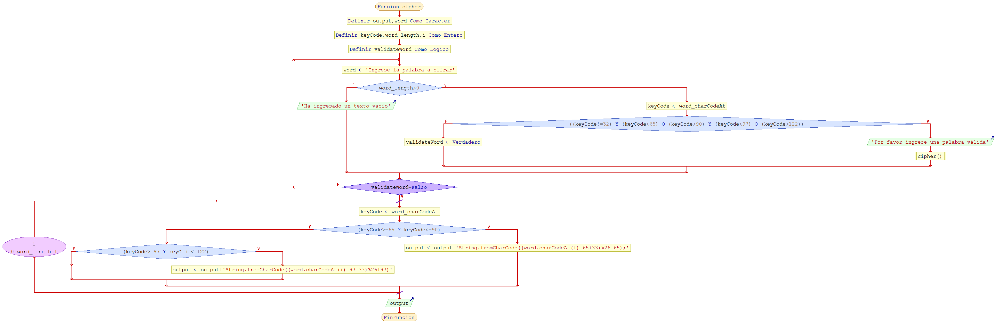
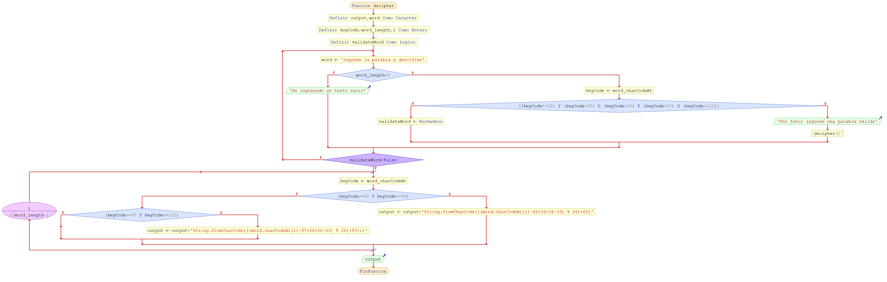

ALGORITMO DE CIFRADO DE CESAR
__________________________


Este programa te permite encriptar mensajes segun el algoritmo de cifrado César.

Elegir una opcion  para elegir si se desea:

Con este programa se puede:
* Cifrar una palabra
	-Se puede combinar letras mayusculas con minusculas.
        -Acepta espacios.
* Descifrar una palabra
	-Se puede combinar letras mayusculas con minusculas.
        -Acepta espacios.

 
La palabra ingresada en la caja de texto no  debe :
1. Ser de longitud igual a 0 
2. Contener algun número
3. Poseer operadores lógicos

Presentamos los diagramas de flujo:



 
 Presentamos el pseudocódigo:
 ```[javascript]
 Funcion cipher // declara la función de cifrado
	Definir output,word Como Caracter // Se declara la variable donde se acumulara la salida luego de ser cifrada
	Definir keyCode,word_length,i Como Entero // Se declara la variable donde se acumulará el codigo ascii de cada letra del word a// se declara la variable lógica e inicializa en false para controlar la validación del word 'válido'
	Definir validateWord Como Logico // se declara la variable lógica e inicializa en false para controlar la validación del word 'válido'
	Repetir // se utiliza un do while para que ingrese por lo menos una vez a solicitar la palabra 'word' y validarla
		word <- 'Ingrese la palabra a cifrar' // Se pide que ingrese la palabra a cifrar.
		Si word_length>0 Entonces // Se condiciona en el caso que la longitud de la palabra 'word' ingresada sea mayor a 0
			keyCode <- word_charCodeAt // Obtenemos el codigo ascii de cada caracter de la palabra 'word'
			Si ((keyCode!=32) Y (keyCode<65) O (keyCode>90) Y (keyCode<97) O (keyCode>122)) Entonces // Restringimos caso que la palabra posea números o caracteres invalidos
				Escribir 'Por favor ingrese una palabra válida' // muestra una alerta del palabra inválida
				cipher() // utilizando la recursividad se vuelve a llamar a la función cifrado
			Sino
				validateWord <- Verdadero // toma el valor de verdadero si la palabra ingresada es válida
			FinSi
		Sino // En el caso que no ingrese nada nos enviara un mensaje
			Escribir 'Ha ingresado un texto vacio' // muestra el mensaje de alerta que ha ingresado una palabra vacía
		FinSi
	Hasta Que validateWord=Falso // se volverá a realizar mientras no se halla podido validar la frase
	Para i<-0 Hasta word_length-1 Hacer // se utiliza un for para recorrer através de los caracteres del palabra 'word'
		keyCode <- word_charCodeAt // Obtenemos el codigo ascii de cada caracter de la     palabra ingresada
		Si (keyCode>=65 Y keyCode<=90) Entonces // para cifrar mayusculas
			output <- output+'String.fromCharCode((word.charCodeAt(i)-65+33)%26+65);' // se acumula el caracter cifrado obtenido de la fórmula
		Sino
			Si (keyCode>=97 Y keyCode<=122) Entonces // para cifrar minusculas
				output <- output+'String.fromCharCode((word.charCodeAt(i)-97+33)%26+97)' // se acumula el caracter cifrado obtenido de la fórmula
			FinSi
		FinSi
	FinPara
	Escribir output // retorna el cifrado de la palabra ingresada como resultado
FinFuncion

Funcion decipher // declara la función de descifrado
	Definir output,word Como Caracter
	Definir keyCode,word_length,i Como Entero
	Definir validateWord Como Logico
	Repetir // se utiliza un do while para que ingrese por lo menos una vez a solicitar la palabra 'word' y validarla
		word <- 'Ingrese la palabra a descifrar' // Se pide que ingrese la palabra a cifrar.
		Si word_length>0 Entonces // Se condiciona en el caso que la longitud de la palabra ingresada sea mayor a 0
			keyCode <- word_charCodeAt // Obtenemos el codigo ascii de cada caracter de la  palabra ingresada word
			Si ((keyCode!=32) Y (keyCode<65) O (keyCode>90) Y (keyCode<97) O (keyCode>122)) Entonces
				Escribir 'Por favor ingrese una palabra válida'
				decipher() // utilizando la recursividad se vuelve a llamar a la función decifrado
			Sino
				validateWord <- Verdadero
			FinSi
		Sino
			Escribir 'Ha ingresado un texto vacio'
		FinSi
	Hasta Que validateWord=Falso
	Para i<-0 Hasta word_length-1 Hacer // se utiliza un for para recorrer através de los caracteres del palabra 'word'
		keyCode <- word_charCodeAt
		Si (keyCode>=65 Y keyCode<=90) Entonces
			output <- output+'String.fromCharCode(((word.charCodeAt(i)-65+26+26-33) % 26)+65)'
		Sino
			Si (keyCode>=97 Y keyCode<=122) Entonces
				output <- output+'String.fromCharCode(((word.charCodeAt(i)-97+26+26-33) % 26)+97);)'
			FinSi
		FinSi
	FinPara
	Escribir output
FinFuncion

Algoritmo principal
	Definir validateOption Como Logico
	Definir selectOption Como Entero
	Repetir
		Segun selectOption  Hacer
			1:
				cipher()
			2:
				decipher()
			De Otro Modo:
				Escribir 'Por favor ingrese una opción válida'
		FinSegun
	Hasta Que validateOption=Falso
FinAlgoritmo


 
Procedemos a explicar el código
```[javascript]
var output='';  // Se declara la variable donde se acumulara la salida luego de ser cifrada
var keyCode=''; // Se declara la variable donde se acumulará el codigo ascii de cada letra del word a
var validateWord=false; // se declara la variable lógica e inicializa en false para controlar la validación del word 'válido'


function cipher() { // declara la función de cifrado


  do{ // se utiliza un do while para que ingrese por lo menos una vez a solicitar la palabra 'word' y validarla
      word=prompt('Ingrese la palabra a cifrar');//Se pide que ingrese la palabra a cifrar.

     if (word.length>0){ //Se condiciona en el caso que la longitud de la palabra 'word' ingresada sea mayor a 0

        for (i=0;i<word.length;i++){ // se utiliza un for para recorrer através de los caracteres del palabra 'word'
            keyCode=word.charCodeAt(i); //Obtenemos el codigo ascii de cada caracter de la palabra 'word'

           if ((keyCode != 32) && (keyCode < 65) || (keyCode > 90) && (keyCode < 97) || (keyCode > 122) ){ //Restringimos caso que la palabra posea números o caracteres invalidos
              alert('Por favor ingrese una palabra válida'); // muestra una alerta del palabra inválida
                 cipher();  // utilizando la recursividad se vuelve a llamar a la función cifrado
           }else{
                 validateWord=true; // toma el valor de verdadero si la palabra ingresada es válida
                }
        }

     } else { //En el caso que no ingrese nada nos enviara un mensaje
             alert('Ha ingresado un texto vacio'); // muestra el mensaje de alerta que ha ingresado una palabra vacía
     }

  }while(validateWord===false);  // se volverá a realizar mientras no se halla podido validar la frase

           for (i=0;i<word.length;i++){  // se utiliza un for para recorrer los carácteres de la palabra
                keyCode=word.charCodeAt(i); //Obtenemos el codigo ascii de cada caracter de la     palabra ingresada

       		 if (keyCode>=65 && keyCode<=90){//para cifrar mayusculas
              output += String.fromCharCode((word.charCodeAt(i)-65+33)%26+65); // se acumula el caracter cifrado obtenido de la fórmula

         	  } else {(keyCode>=97 && keyCode<=122);//para cifrar minusculas
         	  	output += String.fromCharCode((word.charCodeAt(i)-97+33)%26+97);  // se acumula el caracter cifrado obtenido de la fórmula
        	  }
           }


    return output; // retorna el cifrado de la palabra ingresada como resultado
}


function decipher() { // declara la función de descifrado


  do{ // se utiliza un do while para que ingrese por lo menos una vez a solicitar la palabra 'word' y validarla
      word=prompt('Ingrese la palabra a descifrar');//Se pide que ingrese la palabra a descifrar.

     if (word.length>0){ //Se condiciona en el caso que la longitud de la palabra ingresada sea mayor a 0

        for (i=0;i<word.length;i++){ // se utiliza un for para recorrer através de los caracteres del palabra 'word'
            keyCode=word.charCodeAt(i);//Obtenemos el codigo ascii de cada caracter de la  palabra ingresada word

           if ((keyCode != 32) && (keyCode < 65) || (keyCode > 90) && (keyCode < 97) || (keyCode > 122) ){ //Restringimos caso que la palabra posea números o caracteres invalidos
              alert('Por favor ingrese una palabra válida'); // muestra una alerta del palabra word inválida
              decipher(); // utilizando la recursividad se vuelve llamar a la función decipher ()
           }else{
                 validateWord=true; // toma el valor de verdadero si la palabra word ingresada es válida
                }
        }

     } else { //En el caso que no ingrese nada nos enviara un mensaje
             alert('Ha ingresado un texto vacio');
     }

  }while(validateWord===false);  // se volverá a realizar mientras no se halla podido validar la palabra word

  for (i=0;i<word.length;i++){  // se utiliza un for para recorrer por los caracteres de la palabra word
                keyCode=word.charCodeAt(i);//Obtenemos el codigo ascii de cada caracter de la     palabra ingresada

        if (keyCode>=65 && keyCode<=90){//para descifrar mayusculas

    		  output += String.fromCharCode(((word.charCodeAt(i)-65+26+26-33) % 26)+65); // se acumula el caracter descifrado obtenido de la fórmula
        }
        else {(keyCode>=97 && keyCode<=122);//para descifrar minusculas

    		  output += String.fromCharCode(((word.charCodeAt(i)-97+26+26-33) % 26)+97);  // se acumula el caracter descifrado obtenido de la fórmula
        }
      }

  return output;   //Devuelve la palabra ya descifrada
}


var validateOption=false; // se declara la variable lógica e inicializa en false para controlar la validación del word 'opción'

do {  //  se utiliza un do while para que ingrese por lo menos una vez a solicitar la palabra 'option' y validarla

// Presentamos una pantalla con las opciones a elegir según lo que desea realizar
selectOption=parseInt(prompt('Ingrese la acción que desea realizar \n 1.Cifrar un texto \n 2.Descifrar un texto '));

  switch (selectOption) {//Empleamos el switch case para restringir a solo 2 opciones lo que el usuario puede marcar

      case 1:
          validateOption= true; // validación de opción correcta
          alert(cipher());//En el caso que marque 1 se invocará a la función cipher.
          break; // sale de la rutina
      case 2:
          validateOption= true; //validación de opción correcta
          alert(decipher());//En el caso que marque 2 se invocará a la función decipher.
          break; // sale de la rutina

     default:
          validateOption =false; // cuando ha ingresado una opción no válida ( no 1 ó no 2) si la validación es falsa
            if (confirm('Por favor ingrese una opción válida, \n Presione: \n \n [ OK ] si desea Continuar \n \n [ CANCELAR ] si desea Salir')){ //
              continue;// continua con la rutina
           }else{
             break; //sale de la rutina
             }
    }

}while (validateOption ===false ) ;  // realizar mientras que la validación sea falsa para volver a pedir el ingreso de opción
